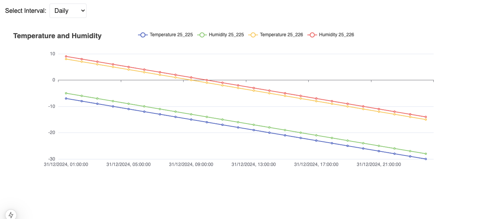

# Arbolitics Front-End Challenge 2025

This repository solves the tasks described on the Front-End task provided.

- Perform a login request
- Request data
- Visualize data

## Setup

The techstack is the latest Next.js, React, Tailwind, TS, echarts-for-react, React forms, and react query as required in the instructions.

## Installation

```bash
  npm i
  npm run dev
```

## Perform a login request


The form is using React forms as recommended. Validation, error handling, and submission are all handled by react forms. Email and password are pre-filled for easier testing.

I created an api proxy to make the request from an api route to bypass CORS. The request is done with react query. Once the request has been done successfully, an accessToken is extracted from the response, and then passed onto the useRouter hook and then redirected to the dashboard page.

## Request data

Once redirected to the dashboard page, a request is made to retrieve data on device types. I used axios to make the request in order to be able to add params on a GET request.

## Visualise data

To visualise data, I used echarts-for-react. There were many options on which graph to use but I opted to use the simple line chart due to time constraints and I preferred to make the straight forward approach.

### Explanation of logic

Since the first point is 01-01-2025 00:00:00, then all the other requests go back in time. The last point should be 01-01-2025 00:00:00. For device 25_225 tem -30, hum -28, 25_226 tem -15, hum -14.



However, couple other ideas I thought about was using a heatmapping chart to go with the theme of temperature and humidity. The other idea was to use water condensation to also go with the humidity theme. Given more time and the opportunity, more creative approaches could have been further explored and implemented.

### Heatmapping:


https://echarts.apache.org/examples/en/editor.html?c=heatmap-cartesian

### Bodyfill:


https://echarts.apache.org/examples/en/editor.html?c=pictorialBar-body-fill
